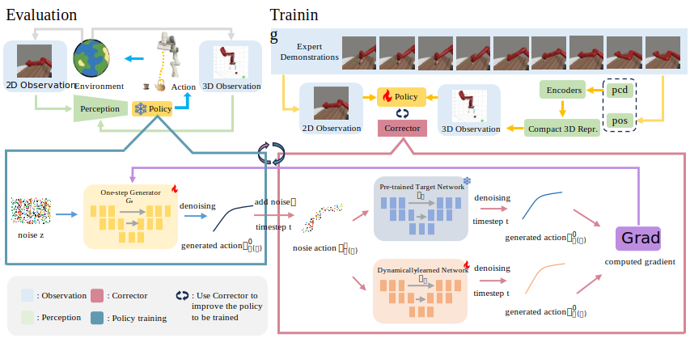

# [Score and Distribution Matching Policy: Advanced accelerated Visuomotor Policies via matched distillation](https://bofangjia1227.github.io/page/)

[Project Page](https://bofangjia1227.github.io/page/) | [arXiv](https://bofangjia1227.github.io/page/) | [Paper](https://bofangjia1227.github.io/page/)

[Bofang Jia](https://bofangjia1227.github.io/page/)\*, [Can Cui](https://bofangjia1227.github.io/page/)\*, [Pengxiang Ding](https://bofangjia1227.github.io/page/)\*, [Mingyang Sun](https://bofangjia1227.github.io/page/), [Pengfang Qian](https://bofangjia1227.github.io/page/), [Siteng Huang](https://bofangjia1227.github.io/page/), [Zhaoxin Fan](https://bofangjia1227.github.io/page/), [Donglin Wang](https://bofangjia1227.github.io/page/)†

 

<b>Overview of SDM Policy</b>: xxxxx.

# 💻 Installation

See [INSTALL.md](INSTALL.md) for installation instructions. 

